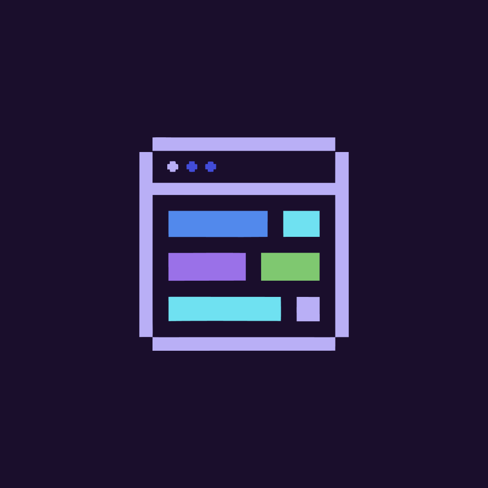
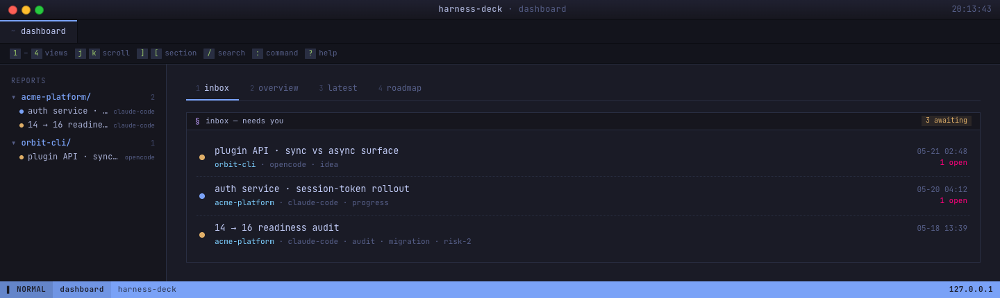
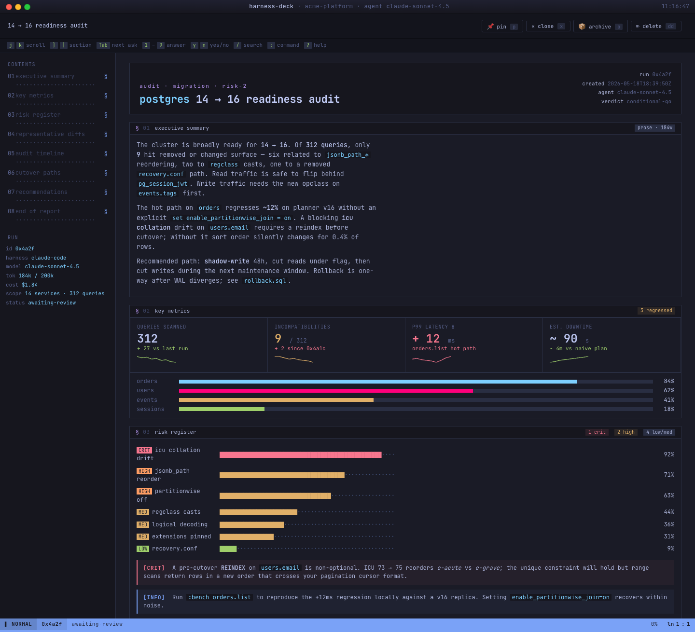
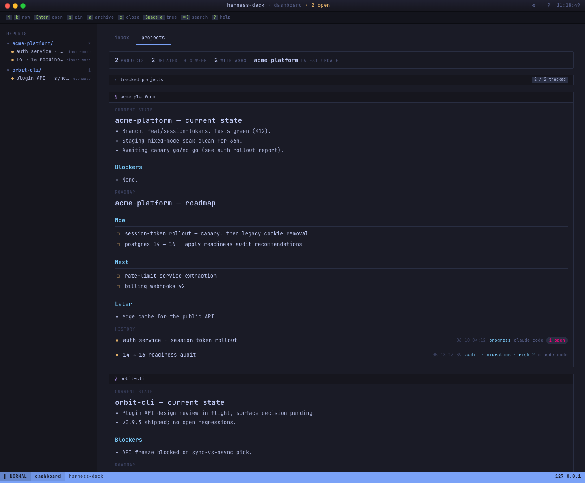
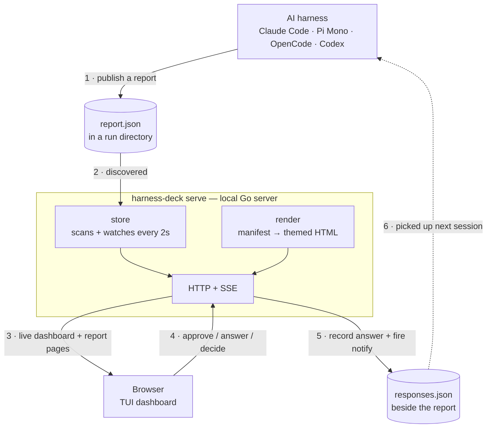

<p align="center">
  
</p>

# harness-deck

A unified dashboard for AI coding work across multiple harnesses (Claude Code,
Pi Mono, OpenCode, …) and across many projects.

Any harness writes a structured **report manifest** (`report.json`); harness-deck
renders it into a consistent, terminal-styled HTML report and aggregates every
report across every project into one live dashboard. Reports can ask for your
opinion, surface a decision, or share an idea — and your responses flow back to
the harness as a `responses.json` file plus a notification.

## Screenshots

The aggregator dashboard — every report across every project and every harness,
with an inbox of the items that are awaiting your review:



A rendered report. The renderer turns a JSON block manifest into a consistent,
terminal-styled page — so every report looks like this, and old reports restyle
when the renderer changes:



The projects view auto-discovers every project under your `scan_roots` (e.g.
`~/git`) and shows each one's `.docs/ai/current-state.md` and `roadmap.md`
together, alongside any reports published with `kind: "roadmap"`. A "tracked
projects" panel lets you uncheck the ones you don't care to follow:



## Status

Actively developed and used daily by its author. Releases ship via Homebrew,
the manifest contract is versioned (`harness-deck/report@1`), and a stale
binary degrades gracefully rather than breaking when the schema grows. Expect
fast iteration on the UI before v1. See
[`.docs/ai/roadmap.md`](.docs/ai/roadmap.md) for the plan and
[`.docs/ai/current-state.md`](.docs/ai/current-state.md) for the latest
breadcrumb.

## How it works



- **Authoring contract:** a JSON block manifest (`report.json`) — an ordered list
  of typed blocks. The renderer owns all HTML/CSS, so every report looks
  consistent and old reports restyle when the renderer changes. A raw-`html`
  block is the escape hatch for UI the vocabulary doesn't cover yet. See
  [`CONTRACT.md`](CONTRACT.md) for the full schema, or
  [`docs/PUBLISHING.md`](docs/PUBLISHING.md) for a walkthrough aimed at tools
  that want to publish into the dashboard. The contract also ships **inside the
  binary** — run `hdeck contract` to print it, or read it over MCP (the
  `harness-deck://contract` resource) — so an agent on any machine has the
  schema without cloning this repo.
- **Visual design:** the "v1 TUI dashboard" — terminal chrome, sidebar tree +
  table of contents + run metadata, stacked content panels, vim navigation,
  Tokyo Night theme.

## Why this exists

AI coding agents are good at editing repos, but their human-facing artifacts can
sprawl: Markdown reports in chat, one-off HTML mockups, decisions buried in
scrollback, and review notes that disappear with the session. harness-deck gives
those artifacts one local place to land.

Think of it as a pane of glass for agent output. Chat is where you talk to the
agent; harness-deck is where the agent shows you things: reports, mockups,
comparisons, approvals, and decisions that should survive a context clear.

The launch article draft lives in
[`docs/launch/medium-pane-of-glass.md`](docs/launch/medium-pane-of-glass.md).

## Install

```sh
brew install taylorfinklea/tap/harness-deck   # installs `harness-deck` + the short `hdeck` alias
brew services start harness-deck              # run now, and again at login (macOS + Linux)
sudo loginctl enable-linger "$USER"           # Linux only — keep it running after logout
hdeck doctor                                  # verify — every failure prints its fix
hdeck open                                    # open the dashboard
```

That's it. **No config file is required** — harness-deck runs on defaults
(`127.0.0.1:7420`, reports in `~/.harness/reports`). macOS binaries are signed
and notarized, so nothing prompts you and nothing gets silently firewalled.

### Show your projects in the dashboard

The one setting most people want is `scan_roots` — the parent directories to
discover projects in (it has no default). Any depth-1 child containing a
`.docs/ai/` directory shows up in the projects view:

```sh
mkdir -p ~/.config/harness-deck
cat > ~/.config/harness-deck/config.json <<'JSON'
{
  "scan_roots": ["~/git"]
}
JSON
brew services restart harness-deck
```

For a repo outside those roots: `hdeck register /path/to/project`.

### Other ways to install

```sh
go install github.com/TaylorFinklea/harness-deck/cmd/harness-deck@latest   # Go 1.26+
```

Or grab a prebuilt binary from the
[releases page](https://github.com/TaylorFinklea/harness-deck/releases). After
`brew tap taylorfinklea/tap`, the bare `brew install harness-deck` also works.

Binaries you build yourself aren't Apple-signed, so on macOS the Application
Firewall may silently block connections from other devices (your phone). `hdeck
doctor` detects exactly that and prints the one-line fix. Homebrew and
release-page binaries are signed and unaffected.

### Or let your coding agent install it

Point any harness (Claude Code, Codex, OpenCode, Cursor, Copilot, …) at this
repo and say **"install harness-deck"**. The repo ships agent instructions —
[`AGENTS.md`](AGENTS.md) for the routing and rules, and
[`docs/SETUP.md`](docs/SETUP.md) as the full runbook — so the agent installs the
binary, registers the start-on-login service, optionally wires up phone access
over Tailscale, and verifies with `hdeck doctor` instead of guessing.

## Build & run

```sh
go build ./...               # build from source
./harness-deck serve         # start the local dashboard
./harness-deck open          # open the dashboard in a dedicated app window
./harness-deck validate report.json
./harness-deck render report.json -o out.html
./harness-deck new --title "first report"  # scaffold a starter report.json
./harness-deck register /path/to/project   # add a project root to the config
./harness-deck contract      # print the embedded report contract (--publishing for the guide)
./harness-deck vapid         # generate the VAPID keypair for phone push (one-time)
./harness-deck cert          # get a Tailscale HTTPS cert + wire it into config
./harness-deck doctor        # preflight checks — every failure prints its fix
./harness-deck version       # print build metadata
```

## Mobile (PWA) + push notifications

harness-deck is also a PWA. Open it on your phone over Tailscale, tap _Add to
Home Screen_, and it installs as a standalone app. iOS lock-screen push
notifications work too — the requirements are tailnet reachability and HTTPS.
Set `"bind": "0.0.0.0"` (or your Tailscale IP) in the config, then:

```sh
hdeck cert        # Tailscale HTTPS cert, written + wired into config.json
hdeck vapid       # one-time push identity
brew services restart harness-deck
hdeck doctor      # verifies TLS, push, and the phone path end to end
```

Open the dashboard on your phone, visit the **settings** view, and tap
_Enable notifications on this browser_. New asks land on the lock screen and
deep-link straight to the report.

If the dashboard works on the Mac but times out from the phone, run `hdeck
doctor` — the macOS Application Firewall silently drops inbound connections
to unsigned binaries, and doctor prints the exact fix. Details, cert renewal
(`hdeck cert --renew` in cron), and manual steps for older binaries:
[`docs/SETUP.md`](docs/SETUP.md#6-optional-tailscale-https-pwa-and-push).

## Notification fan-out

Alongside Web Push, harness-deck can fan every new ask out to Slack, Discord,
or any HTTP webhook (n8n, Zapier, custom). Add destinations from the
**settings** view (or directly to `config.json`):

```jsonc
// ~/.config/harness-deck/config.json
{
  "public_url": "https://scadrial.tailceb58.ts.net:7420",
  "notifications": [
    {"name": "team-alerts", "type": "slack",   "url": "https://hooks.slack.com/services/…"},
    {"name": "my-server",   "type": "discord", "url": "https://discord.com/api/webhooks/…"},
    {"name": "n8n",         "type": "webhook", "url": "https://n8n.example.com/…",
     "projects": ["work-project"]}
  ]
}
```

`public_url` is the URL the chat-side link should point at — without it the
fallback is `<bind>:<port>` which won't resolve when `bind` is `0.0.0.0`.
Per-destination `projects` is an optional allowlist; omit it to fire for
every project. Sends are fire-and-forget with a per-attempt log line — no
retry queue, on the principle that the next still-open ask re-fires
automatically.

## License

MIT — see [LICENSE](LICENSE).
