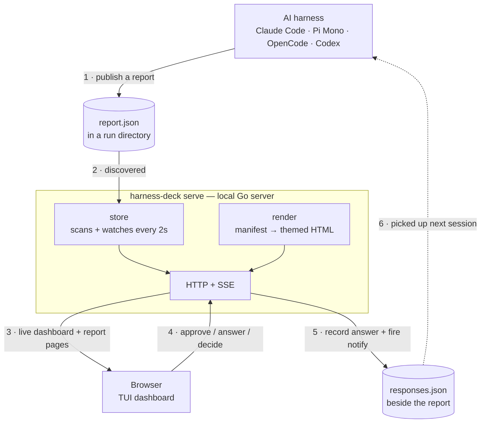

<p align="center">
  
</p>

# harness-deck

A unified dashboard for AI coding work across multiple harnesses (Claude Code,
Pi Mono, OpenCode, …) and across many projects.

Any harness writes a structured **report manifest** (`report.json`); harness-deck
renders it into a consistent, terminal-styled HTML report and aggregates every
report across every project into one live dashboard. Reports can ask for your
opinion, surface a decision, or share an idea — and your responses flow back to
the harness as a `responses.json` file plus a notification.

## Screenshots

The aggregator dashboard — every report across every project and every harness,
with an inbox of the items that are awaiting your review:


A rendered report. The renderer turns a JSON block manifest into a consistent,
terminal-styled page — so every report looks like this, and old reports restyle
when the renderer changes:


The roadmap view aggregates each registered project's `.docs/ai/roadmap.md`
alongside any reports published with `kind: "roadmap"`:


## Status

Early build. See [`.docs/ai/roadmap.md`](.docs/ai/roadmap.md) for the phased plan
and [`.docs/ai/current-state.md`](.docs/ai/current-state.md) for the latest
breadcrumb.

## How it works



- **Authoring contract:** a JSON block manifest (`report.json`) — an ordered list
  of typed blocks. The renderer owns all HTML/CSS, so every report looks
  consistent and old reports restyle when the renderer changes. A raw-`html`
  block is the escape hatch for UI the vocabulary doesn't cover yet. See
  [`CONTRACT.md`](CONTRACT.md).
- **Visual design:** the "v1 TUI dashboard" — terminal chrome, sidebar tree +
  table of contents + run metadata, stacked content panels, vim navigation,
  Tokyo Night theme.

## Build & run

```sh
go build ./...
./harness-deck serve        # starts the local dashboard
./harness-deck validate report.json
./harness-deck render report.json -o out.html
```

## License

MIT — see [LICENSE](LICENSE).
